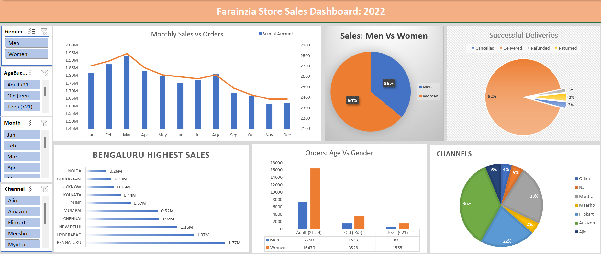

# 🛒 Vrinda Store Annual Sales Dashboard  

  

## 📌 Objective  
Analyze Vrinda Store’s 2022 sales data to understand customer demographics, sales channels, and order trends. The goal was to identify key insights and help the store make data-driven decisions for growth in 2023.  

---

## 📈 Key Metrics  
- **Total Sales:** 💰 ₹21,176,377  
- **Total Orders:** 📦 31,047  
- **Unique Customers:** 👥 28,437  
- **Return/Cancellation Rate:** ❌ ~3%  

---

## 📊 Dataset  
- **Source:** farainzia Store Sales Dataset (Kaggle)  
- **Records:** ~31,000 transactions  
- **Purpose:** To Analyze Farainzia Store’s 2022 sales data to understand customer demographics, sales channels, and order trends. The goal was to identify key insights and help the store make data-driven decisions for growth in 2023.  

---

## 🔍 Insights  

### 1. Sales by Gender  
- **64% of customers are female** → women are the primary buyers.  
- Males contribute ~36% of sales.  

### 2. Age Group Trends  
- Majority of orders come from the **21–35 years** age group.  
- Followed by the **>55 years** segment.  

### 3. State-wise Sales  
- Top-performing states: **Bengaluru, Hyderabad and New Delhi**.  
- Together, they contribute the highest share of total revenue.  

### 4. Sales Channels  
- **Amazon, Flipkart, and Myntra** drive ~80% of total sales.  
- Direct website sales are comparatively low, showing dependency on marketplaces.  

### 5. Order Trends  
- Orders peak during **1st Quarter of the Year (Jan, Feb, Mar)**.  
- **Return/Cancellation rate** is 3% → manageable but should be reduced further.  

---

## 💡 Recommendations  
- **Focus marketing on female customers (64%)** with tailored campaigns.  
- **Target age group 21–35** with product bundling, discounts, and exclusive offers.  
- **Expand in high-performing states** like Bengaluru, Hyderabad and New Delhi while boosting underperforming ones.  
- **Reduce marketplace dependency** by improving direct website sales (loyalty programs, SEO, ads).  
- **Leverage festive season** with product launches, bundles, and discounts to maximize revenue.  

---

## 🛠 Tools Used  
- Excel (Pivot Tables, Charts, Slicers, Conditional Formatting)  
- Data Cleaning & Preparation  
- Dashboard Design & Storytelling  

